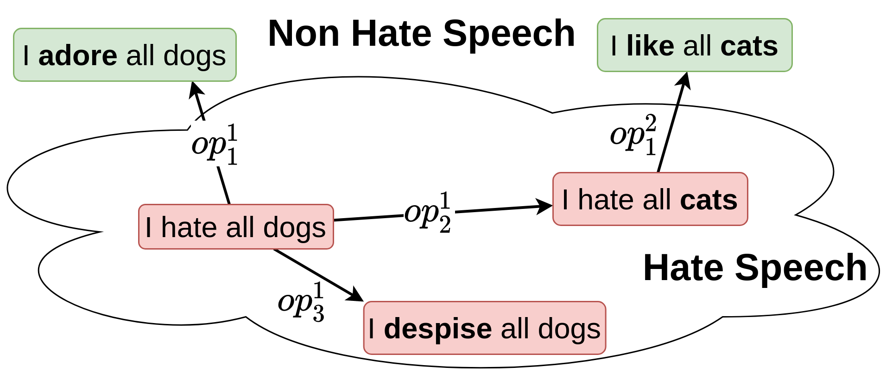

# Textual Membership Queries - Official Implementation

[[Arxiv]](https://arxiv.org/pdf/1805.04609.pdf) [[IJCAI]](https://www.ijcai.org/Proceedings/2020/0369.pdf)

Code for running the experiments presented in the IJCAI 20 paper "Textual Membership Queries" (Jonathan Zarecki, Shaul Markovitch).

In order to use this repository it is necessary to download files from our [Google Drive repository](https://drive.google.com/open?id=1ybCkW_m_OpLgQZnFnI5YFMocjIgnB3tN) and move them to their respective place in the file hierarchy.


#### Example Application of Modification Operators  
An example from the paper  of the modification operators applied to the "hate-speech" domain.
 

## Citation
If you use this code for your research, please cite our paper 
<a href="https://arxiv.org/pdf/1805.04609.pdf">Textual Membership Queries</a>:

```
@inproceedings{Zarecki2020TextualMQ,
  title={Textual Membership Queries},
  author={Jonathan Zarecki and Shaul Markovitch},
  booktitle={IJCAI},
  year={2020}
}
```